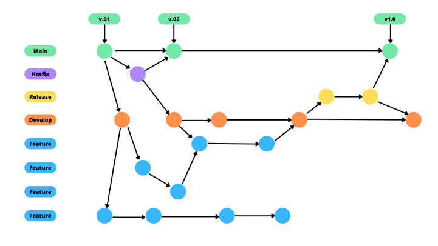

# Metodologia

A metodologia adotada neste projeto busca seguir uma ordem para sua eficiência e organização no qual é detalhada a seguir. 

## Controle de Versão

O controle de versão é responsável por rastrear e gerenciar as alterações em um código de software. Dessa forma, as ferramentas de controle de versão auxiliam no gerenciamento das equipes por conta das alterações ao código-fonte ao longo do tempo. O controle de versão e a ferramenta adotados no projeto são, respectivamente, o Git e o GitHub. 
Os sistemas de Source Control Management (SCM – Gerenciamento de controle do código-fonte) disponibilizam um histórico de execuções e manutenções de desenvolvimento no código, assim como ajudam a resolver conflitos durante a mesclagem de contribuições de várias origens.  

Assim sendo, o projeto segue a seguinte convenção para o nome de branches: 

- `main`: versão estável já testada do software; 
- `hotflix`: versão usada para corrigir os lançamentos de produção; 
- `release`: versão em testes do software; 
- `develop`: versão de desenvolvimento do software; 
- `feature`: uma nova funcionalidade do site ou atualização da documentação que precisa ser introduzida.

## Gerenciamento de Projeto

### Divisão de Papéis

Para o gerenciamento do projeto, a equipe optou pelo Scrum, metodologia ágil na otimização do processo de desenvolvimento. 

A equipe está organizada da seguinte maneira: 

- Scrum Master: Alana Vasconcelos 
- Product Owner: Lion Simon 
- Equipe de Desenvolvimento: Isabela Oliveira, João Paulo e Marco Antônio 
- Equipe de Design: Thiago Terra 

### Processo

A equipe segue a ferramenta Scrum, uma metodologia Agile responsável por auxiliar a gestão de projetos. O Scrum, se diferencia porque promove a junção de profissionais com diferentes papéis em um único time, dessa forma todos participam do desenvolvimento do projeto, sendo, de fato, uma só equipe.  
O time ágil é organizado de forma que pessoas fiquem responsáveis por garantir a qualidade, eficácia e eficiência do projeto. Isso é alcançado através dos pequenos ciclos de atividades e reuniões constantes para que a equipe possa alinhar o que vem fazendo e pensar formas de melhorar o processo com agilidade. 
Inicialmente, o P.O reuniu a equipe e apresentou o pacote de funcionalidades do projeto (o product backlog). A partir disso, as Sprints (os ciclos) foram definidas para a realização das tarefas. A Daily Scrum do grupo acontecia às 20:30 e, no início de cada sprint, acontecia a Sprint Planning Meeting para o planejamento e priorização dos itens do Product Backlog para aquele período.

### Relações de Ambientes de Trabalho

Os artefatos do projeto são desenvolvidos a partir de algumas ferramentas e ambientes de trabalho e os mesmos são apresentados a seguir:

|    AMBIENTE        |        PLATAFORMA                  |LINK DE ACESSO                          |
|--------------------|------------------------------------|----------------------------------------|
|Repositório do código fonte  | GitHub | https://github.com/ICEI-PUC-Minas-PMV-ADS/pmv-ads-2022-1-e1-proj-web-t10-redom-pet  |
|Documentos do projeto | OneDrive   | https://sgapucminasbr-my.sharepoint.com/personal/1401789_sga_pucminas_br/_layouts/15/onedrive.aspx?id=%2Fpersonal%2F1401789%5Fsga%5Fpucminas%5Fbr%2FDocuments%2FREDOM%2DPET%20%2D%20Arquivos&ga=1 |
|Projeto de Interface e Wireframes | Figma | https://www.figma.com/file/Y7PikQcB8ZZHwyp0ttTr0X/Projeto---REDOM-PET-(Rede-de-Doa%C3%A7%C3%A3o-de-Medicamentos-para-Pet)?node-id=0%3A1 |
|Gerenciamento do Projeto | GitHub - Projects | https://github.com/ICEI-PUC-Minas-PMV-ADS/pmv-ads-2022-1-e1-proj-web-t10-redom-pet/projects/2 |

### Ferramentas

As ferramentas empregadas no projeto são: 

- Editor de código: Visual Studio Code 
O editor de código escolhido foi o Visual Studio Code porque ele possui uma integração com o sistema de versão e facilidade no manuseio por parte de quem está iniciando na área. 
- Ferramentas de comunicação: Teams 
A ferramenta de comunicação utilizada entre o grupo é o Microsoft Teams, disponibilizado pela PUC Minas, para reuniões de planejamento do projeto. 
 
- Ferramentas de desenho de tela (wireframing) e prototipação: Figma 
O projeto em Wireframe foi criado na plataforma de prototipagem Figma, e a mesma ferramenta será utilizada para o protótipo de baixa fidelidade do projeto. O mesmo pode ser [acessado aqui](https://www.figma.com/file/Y7PikQcB8ZZHwyp0ttTr0X/Projeto---REDOM-PET-(Rede-de-Doa%C3%A7%C3%A3o-de-Medicamentos-para-Pet)?node-id=0%3A1). 
 
- Ferramenta de backup dos documentos: OneDrive 
O backup dos documentos está sendo feito no OneDrive para facilitar o compartilhamento dos arquivos entre a equipe. O mesmo pode ser [acessado aqui](https://sgapucminasbr-my.sharepoint.com/personal/1401789_sga_pucminas_br/_layouts/15/onedrive.aspx?id=%2Fpersonal%2F1401789%5Fsga%5Fpucminas%5Fbr%2FDocuments%2FREDOM%2DPET%20%2D%20Arquivos&ga=1).
 
- Ferramenta de gerenciamento de projeto: GitHub 
O quadro Kanban do grupo no GitHub Classroom foi organizado e distribuído com as tarefas conforme a Figura W. A definição desta estrutura se baseou na proposta feita por Littlefield (2016) e mesmo está [disponível aqui](https://github.com/ICEI-PUC-Minas-PMV-ADS/pmv-ads-2022-1-e1-proj-web-t10-redom-pet/projects/2).

 

**Meeting**: esta coluna apresenta os dias que aconteceram as reuniões da equipe, assim como os principais tópicos tratados. 
**Backlog**: esta coluna apresenta as atividades a serem desenvolvidas, ou seja, o Product Backlog. Todas as atividades que acontecerão no projeto estarão dispostas nessa coluna. 
**To Do**: esta coluna representa o Sprint Backlog. Este é o Sprint atual que estamos trabalhando. 
**In progress**: quando uma tarefa tiver sido iniciada é movida para esta coluna. 
**Test**: esta coluna é para checar a qualidade do que está sendo produzido. Antes de qualquer entrega todos os tópicos dessa coluna deverão ser finalizados. 
**Done**: nesta coluna são colocadas as tarefas que passaram pelos testes e controle de qualidade e estão prontos para ser entregues ao usuário.  
**Locked**: esta coluna é preenchida quando há algo que impeça a conclusão da tarefa, também é feito um comentário explicando aos demais integrantes da equipe o motivo do impedimento. 
