# Projeto de Interface

O detalhamento da interface do sistema levou em consideração questões como acessibilidade, usabilidade e agilidade. Assim sendo, o projeto possui uma identidade padronizada em todas as telas e foram projetadas para permitir a navegabilidade em desktops e dispositivos móveis.

## Fluxo de usuário

A Figura 3 apresentada abaixo detalha o fluxo de interação do usuário pelas telas do sistema de acordo com a necessidade “Quero receber”.

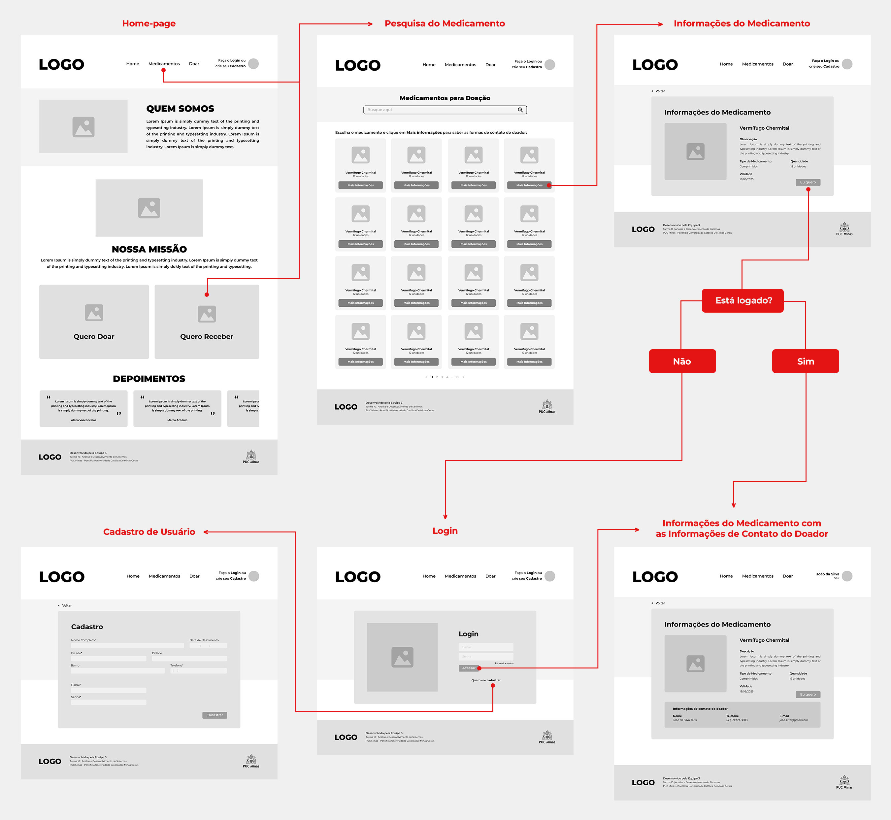

A Figura 4 apresentada abaixo detalha o fluxo de interação do usuário pelas telas do sistema de acordo com a necessidade “Quero doar”.

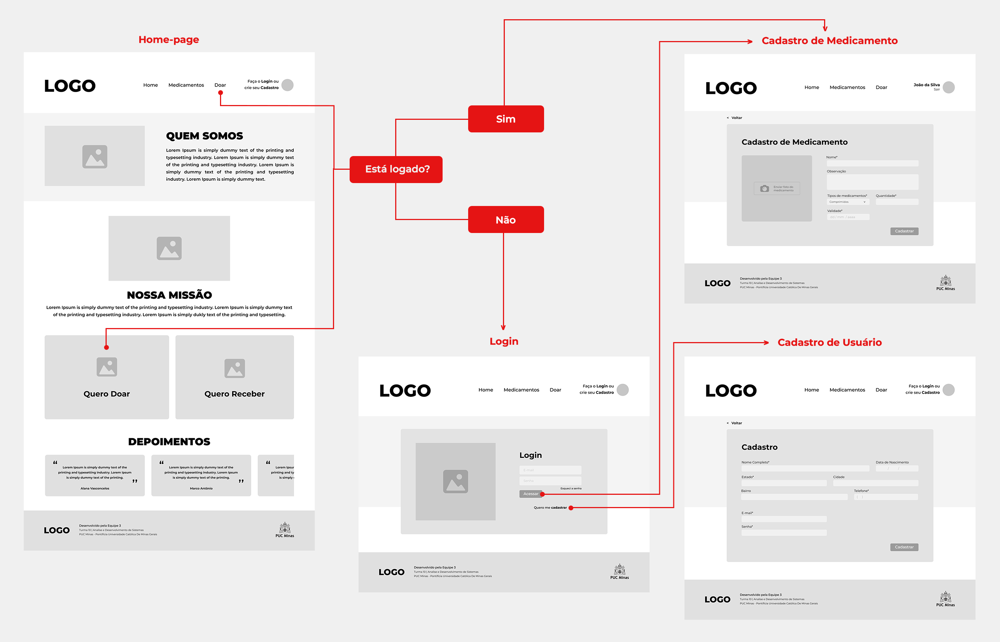

A Figura 5 apresentada abaixo detalha o fluxo de interação do usuário pelas telas do sistema de acordo com a necessidade de acessar seu “Perfil de Usuário” para editar e visualizar as informações referentes ao mesmo.

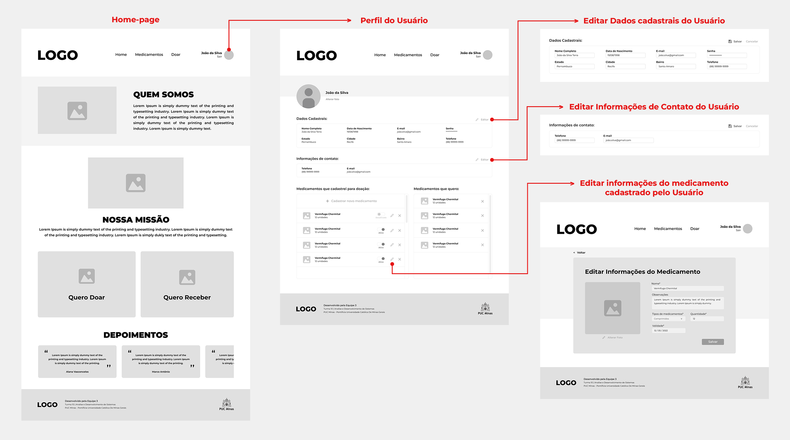

Cada uma das telas representadas nos fluxos será detalhada na seção de Wireframes e para visualizar o wireframe interativo,[clique aqui](<https://www.figma.com/file/Y7PikQcB8ZZHwyp0ttTr0X/Projeto---REDOM-PET-(Rede-de-Doa%C3%A7%C3%A3o-de-Medicamentos-para-Pet)?node-id=0%3A1>).

## Wireframes

No fluxo de telas do projeto, detalhado no item anterior, é possível observar que as mesmas apresentam uma estrutura padrão comum – tal como apresentado na Figura 6 –. Nesta estrutura existem, três grandes blocos descritos a seguir:

- Cabeçalho: local onde são dispostos elementos fixos de identidade (logo) e navegação principal do site (menu da aplicação);
- Conteúdo: apresenta o conteúdo da tela em questão;
- Rodapé: apresenta informações sobre a equipe de desenvolvimento.

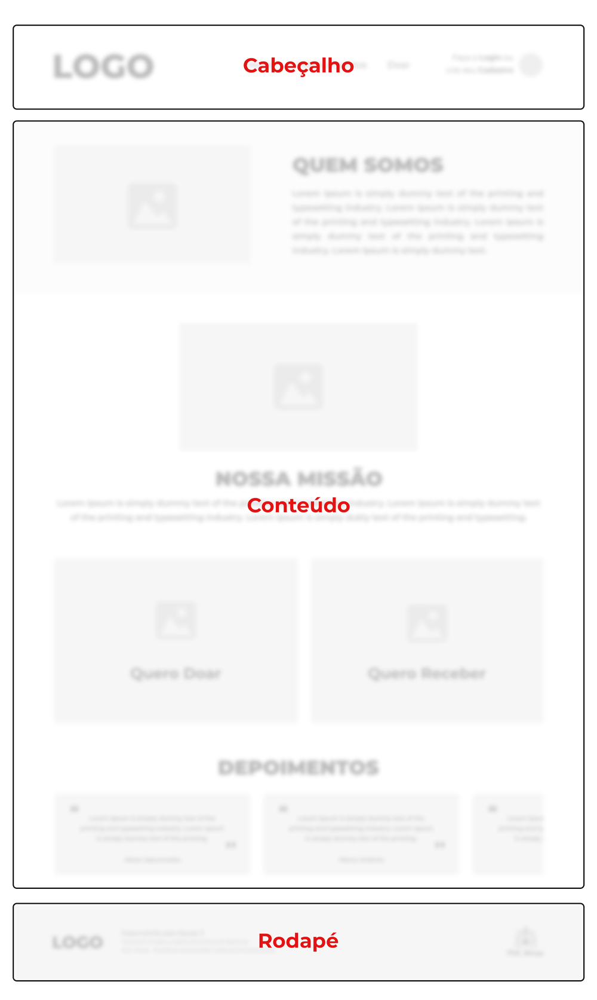

### Tela - Homepage

Na tela homepage temos um menu de navegação com os componentes de home, medicamentos, doar e login ou cadastro. 
No bloco de conteúdo é possível visualizar informações de quem somos, missão, depoimentos e os componentes de “Quero doar” e “Quero receber”. Tais componentes são fluxos que o usuário poderá percorrer no site, dessa forma:

- O fluxo “Quero doar” permite o usuário cadastrar um medicamento para possível doação no sistema.
- O fluxo “Quero receber” permite o usuário pesquisar ou acessar uma lista de medicamentos disponíveis no sistema. 
  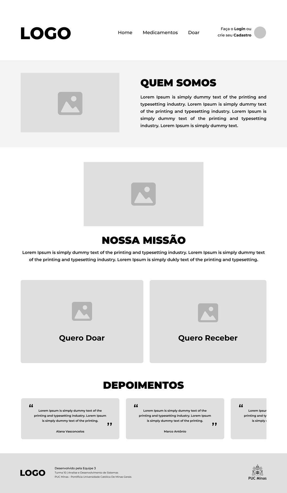

### Tela - Login

A tela de login contém dois campos, onde o usuário informa seu e-mail e senha cadastrados para realizar o login no sistema e assim ter acesso a determinados funções. Esta tela também apresenta uma opção para novos usuários que ainda não possuem cadastro no sistema conseguirem realizá-lo.

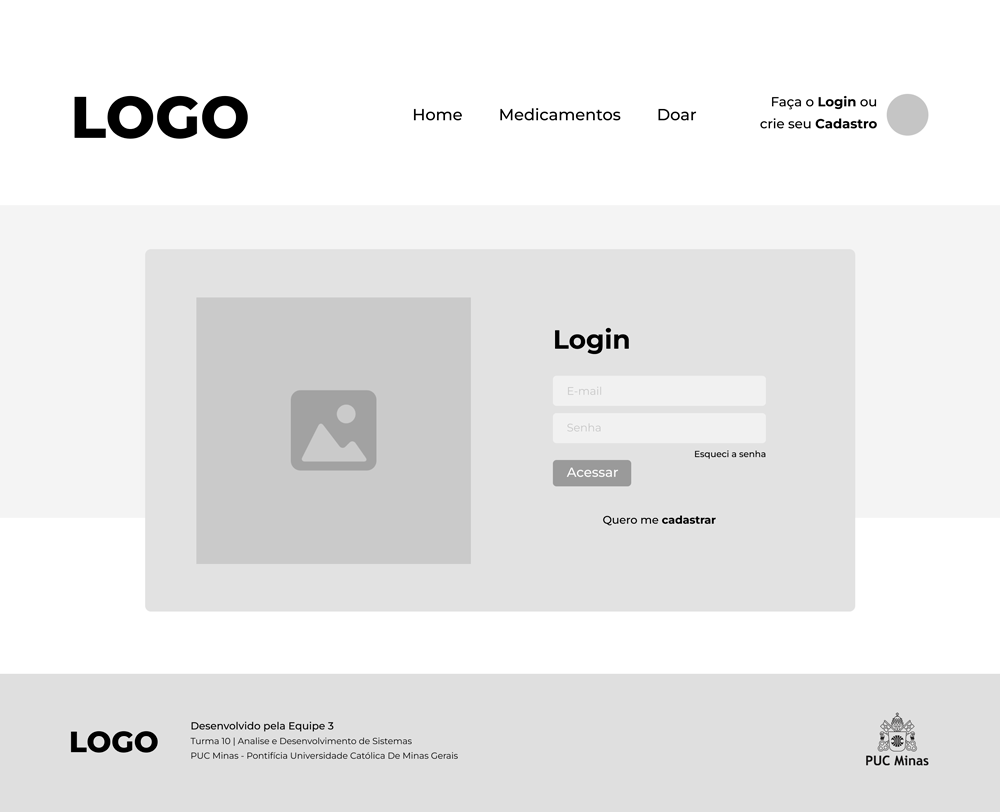

### Tela - Cadastro de Usuário

Caso o usuário não possua um cadastro, é nessa tela que ele realizará o mesmo. Ela possui campos para inserção de informações pessoais importantes para o funcionamento do sistema. Logo após preenchido os campos, o usuário deve clicar no botão “cadastrar” para efetivar seu cadastro.

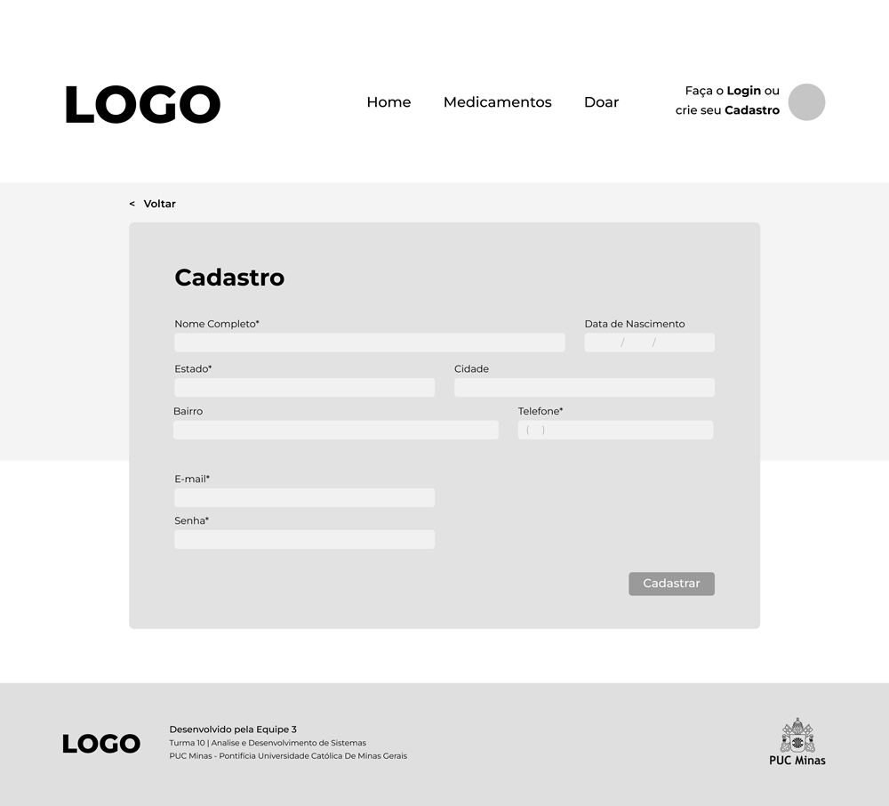

### Tela - Perfil do Usuário

A tela de Perfil do Usuário, no bloco conteúdo, trará a foto, dados cadastrais, informações de contato e informações sobre os medicamentos cadastrados por esse usuário e os medicamentos que ele gostaria de receber, assim como funcionalidades para excluir ou alterá-los.

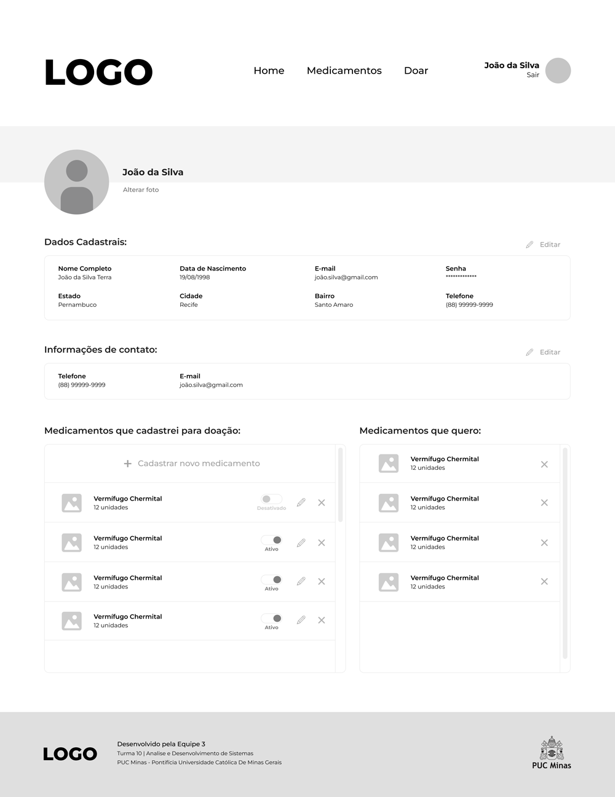

### Tela - Medicamentos

A tela de medicamentos apresenta, no bloco de conteúdo, os medicamentos que foram cadastrados assim como uma barra de pesquisa para a busca ser mais direta.

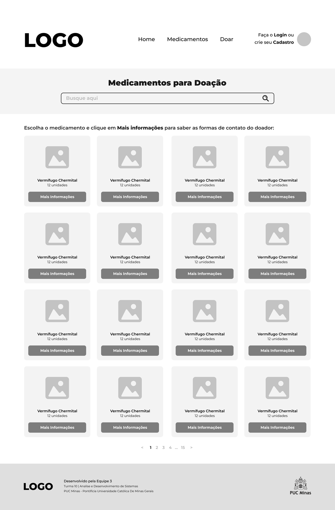

### Informações do Medicamento

A tela de Informações do Medicamento apresenta, no bloco de conteúdo, todas as informações sobre o medicamento e um botão “Eu quero” para sinalizar as intenções do receptor para o doador. Assim que o receptor clicar no botão, aparecerá as informações previamente cadastradas pelo doador.

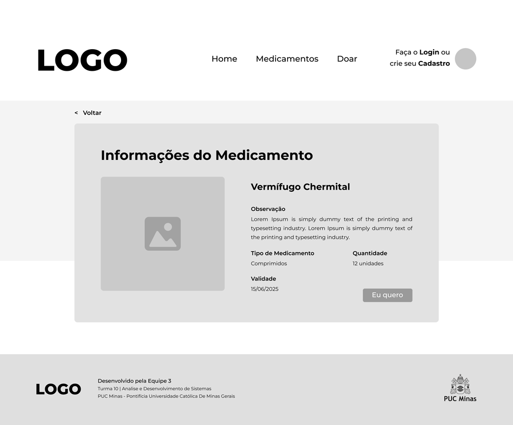

### Tela Cadastro do Medicamento

A tela de Cadastro de Medicamento contará, no Bloco de Conteúdo, informações como: nome, observação/descrição, tipo, quantidade, foto e validade do medicamento. Após o preenchimento de todas as informações obrigatórias o botão “Cadastrar” ficará ativo.

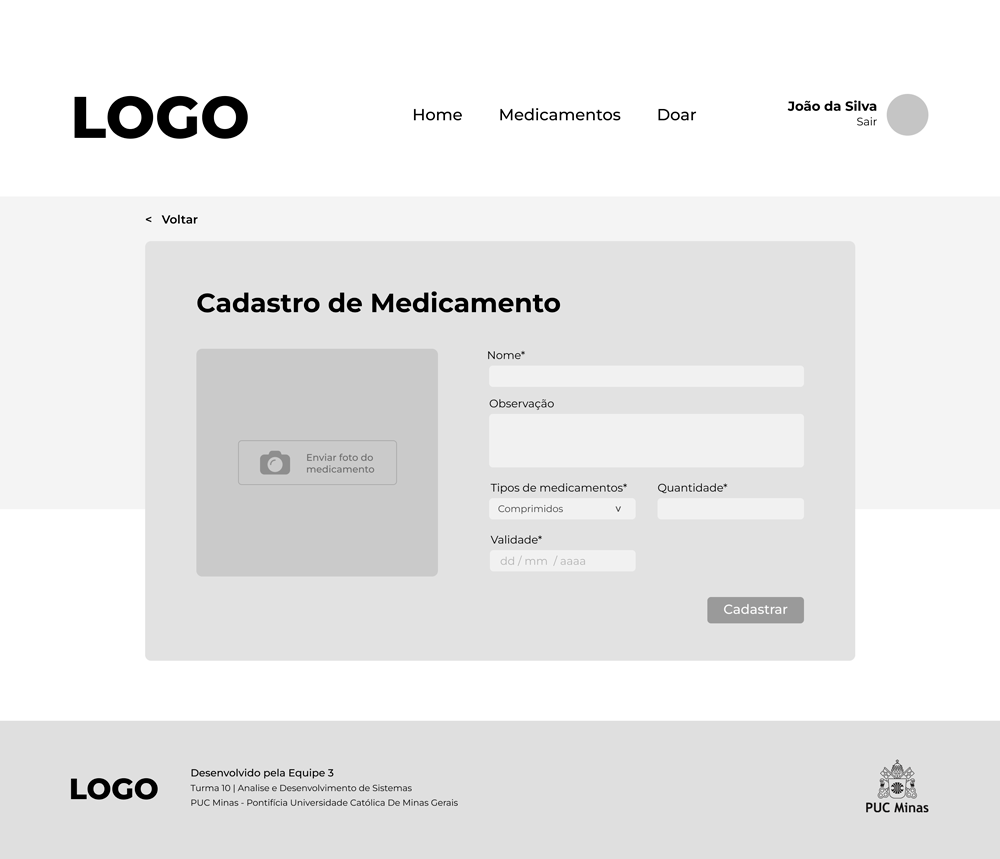
