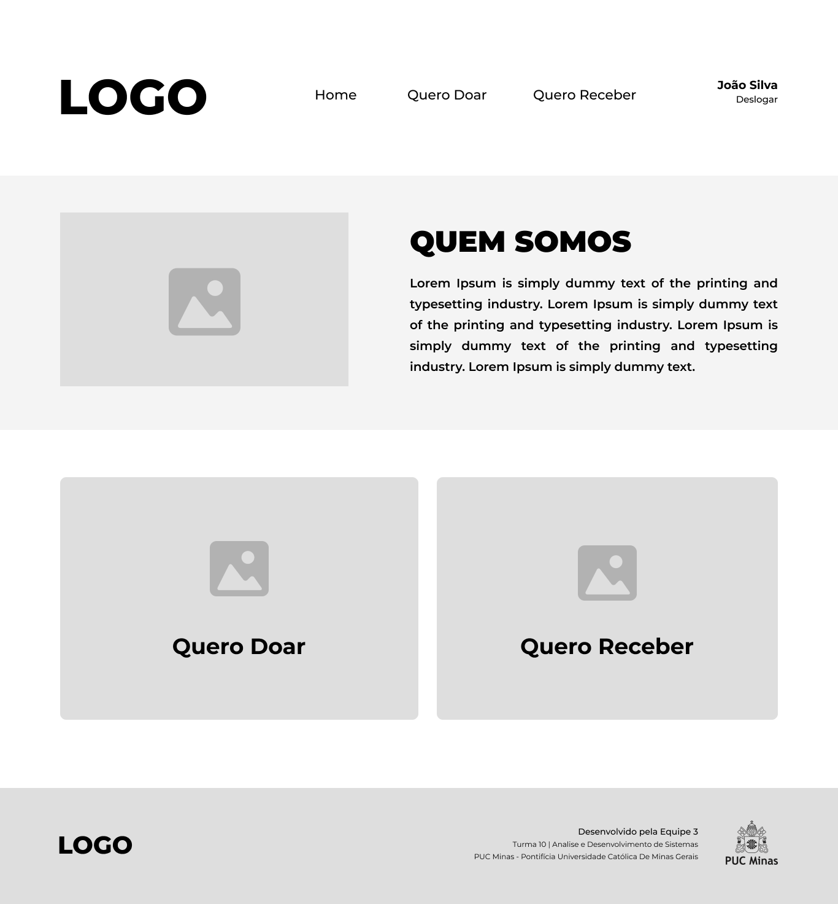

# Projeto de Interface

O detalhamento da interface do sistema levou em consideração questões como acessibilidade, usabilidade e agilidade. Assim sendo, o projeto possui uma identidade padronizada em todas as telas e foram projetadas para permitir a navegabilidade em desktops e dispositivos móveis.

## Fluxo de usuário

A Figura 3 apresentada abaixo detalha o fluxo de interação do usuário pelas telas do sistema de acordo com a necessidade “Quero receber”.

A Figura 4 apresentada abaixo detalha o fluxo de interação do usuário pelas telas do sistema de acordo com a necessidade “Quero doar”.

A Figura 5 apresentada abaixo detalha o fluxo de interação do usuário pelas telas do sistema de acordo com a necessidade de acessar seu “Perfil de Usuário” para editar e visualizar as informações referentes ao mesmo.

Cada uma das telas representadas nos fluxos será detalhada na seção de Wireframes e para visualizar o wireframe interativo, [clique aqui](<https://www.figma.com/file/Y7PikQcB8ZZHwyp0ttTr0X/Projeto---REDOM-PET-(Rede-de-Doa%C3%A7%C3%A3o-de-Medicamentos-para-Pet)?node-id=0%3A1>).

## Wireframes

No fluxo de telas do projeto, detalhado no item anterior, é possível observar que as mesmas apresentam uma estrutura padrão comum – tal como apresentado na Figura 6 –. Nesta estrutura existe três grandes blocos descritos a seguir:

1. **Cabeçalho**: local onde são dispostos elementos fixos de identidade (logo) e navegação principal do site (menu da aplicação);
2. **Conteúdo**: apresenta o conteúdo da tela em questão;
3. **Rodapé**: apresenta informações sobre a equipe de desenvolvimento.

### Tela - Homepage

Na tela homepage temos um menu de navegação com os componentes de Home, Quero doar, Quero receber, Nome do usuário e Deslogar.

No bloco de conteúdo é possível visualizar informações de Quem Somos e os componentes de “Quero doar” e “Quero receber”. Tais componentes são fluxos que o usuário poderá percorrer no site, dessa forma:

- O fluxo “Quero doar” permite o usuário cadastrar um medicamento para possível doação no sistema.  
- O fluxo “Quero receber” permite ao usuário acessar uma lista de medicamentos disponíveis no sistema.

### Tela - Login

A tela de login contém a logo do site e um texto sobre o objetivo da REDOM-PET. Ela conta, também, com dois campos onde o usuário cadastrado informa seu e-mail e senha cadastrados anteriormente e clica em acessar para realizar o login no sistema e assim ter acesso a determinados funções. Esta tela também apresenta uma opção para novos usuários que ainda não possuem cadastro no sistema conseguirem realizá-lo. Também conta com uma mensagem que demonstra o propósito da iniciativa.

### Tela - Cadastro de Usuário

Caso o usuário não possua um cadastro, é nessa tela que ele realizará o mesmo. Ela possui campos para inserção de informações pessoais importantes para o funcionamento do sistema. Logo após preenchido os campos, o usuário deve clicar no botão “cadastrar” para efetivar seu cadastro.

### Tela - Perfil do Usuário

A tela “Perfil do Usuário” trará no seu conteúdo os dados cadastrais do usuário assim como suas informações para contato.

### Tela - Medicamentos

A tela de medicamentos apresenta uma lista com as medicações cadastradas no site, bem como as informações de contato do doador.

### Tela - Cadastro do Medicamento

A tela de Cadastro de Medicamento contará, no Bloco de Conteúdo, com informações como: nome, tipo, quantidade, foto e validade do medicamento. Após o preenchimento de todas as informações obrigatórias o botão “Cadastrar” ficará ativo.

