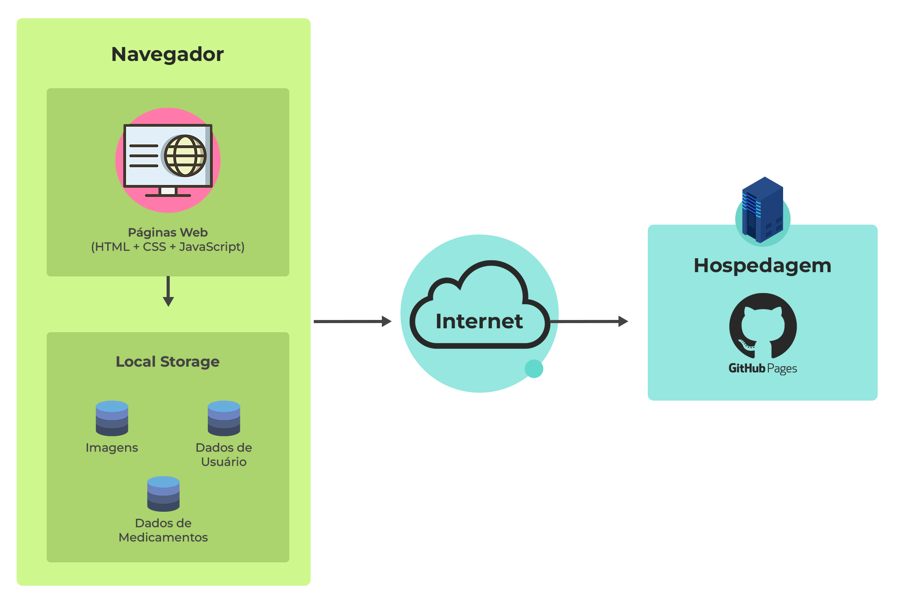

# Arquitetura da Solução

A arquitetura de solução é responsável por construir e implementar soluções com base nas necessidades do negócio. Pensando nisso, esta seção é composta dos detalhes técnicos, dos componentes e do ambiente de hospedagem que serão utilizados no projeto.

## Diagrama de componentes

A Figura 14 detalha os componentes que fazem parte da aplicação.

A solução implementada conta com os seguintes módulos:
- Navegador - Interface básica do sistema
    - Páginas Web - Conjunto de arquivos HTML, CSS, JavaScript e imagens que implementam as funcionalidades do sistema.
    - Local Storage - armazenamento mantido no Navegador, onde são implementados bancos de dados baseados em JSON. São eles:

        - Imagens - imagens dos medicamentos adicionadas pelo doador e imagens gerais do sistema;
        - Dados de usuário - registro de informações dos usuários sobre seus dados;
        - Dados de medicamentos - medicamentos cadastrados no sistema, assim como as informações do mesmo.

- Hospedagem - serviço on-line onde os arquivos são armazenados e acessados pelo navegador.

## Tecnologias Utilizadas

Para a implementação da solução faremos uso de algumas tecnologias, tal como o Visual Studio Code (VS Code), trata-se de um editor de código-fonte - também conhecido como IDE de desenvolvimento – foi escolhido por ser de fácil utilização. A equipe faz uso da ferramenta de comunicação da Microsoft, o Teams, onde acontece as reuniões com a orientadora do projeto.

Para a criação dos wireframes e protótipos foi escolhido o Figma por se tratar de uma ferramenta de design para interfaces com possibilidade de trabalho colaborativo, além da forma intuitiva como ele se apresenta. Para uma segurança dos arquivos, definimos o OneDrive, serviço de armazenamento em nuvem da Microsoft, como ferramenta de backup e armazenamento.

O GitHub também está sendo utilizado por se tratar de um serviço baseado em nuvem e que hospeda um sistema de controle de versão – o Git –. Para a hospedagem da nossa aplicação será utilizado o GitHub Pages, trata-se de um serviço de hospedagem de site estático que usa arquivos HTML, CSS e JavaScript diretamente de um repositório no GitHub.

Pela equipe ser iniciante na área e não ter conhecimento de frameworks ainda, utilizaremos as linguagens ensinadas na disciplina de Desenvolvimento Web Front-End que são: HTML, CSS e JavaScript.

## Hospedagem

O site do projeto utiliza a plataforma GitHub Pages como serviço de hospedagem. O site pode ser [acessado aqui](https://icei-puc-minas-pmv-ads.github.io/REDOM-PET/).