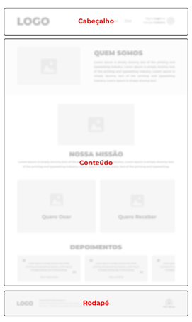
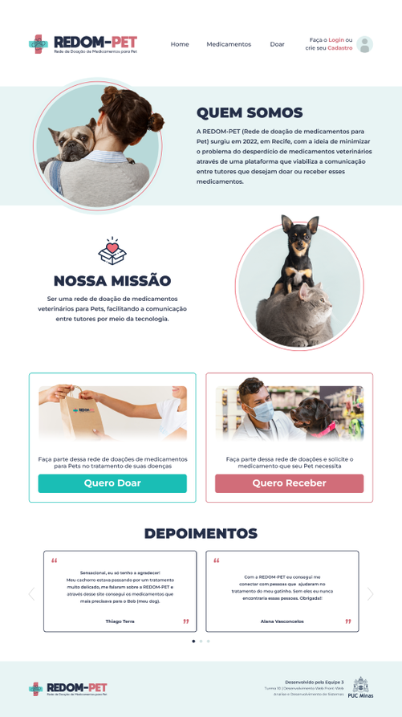
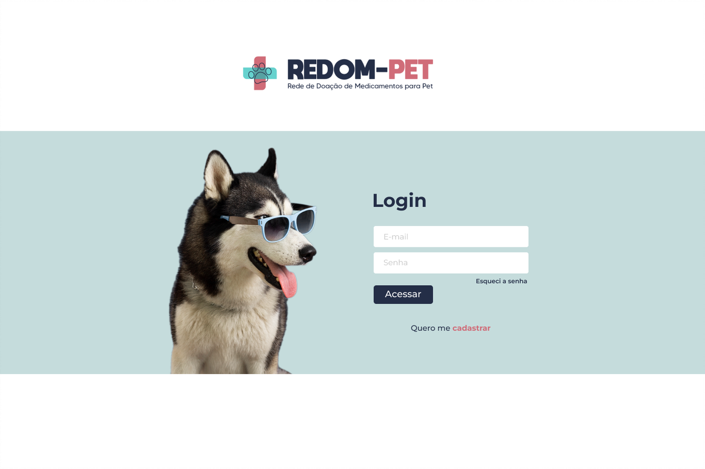
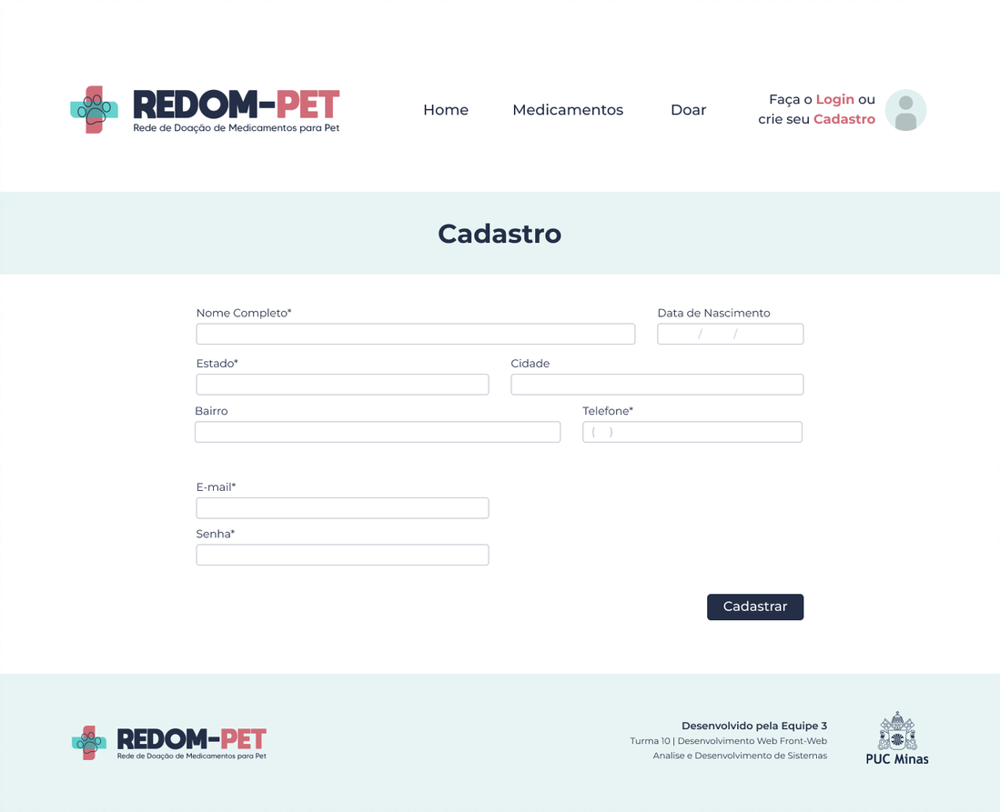
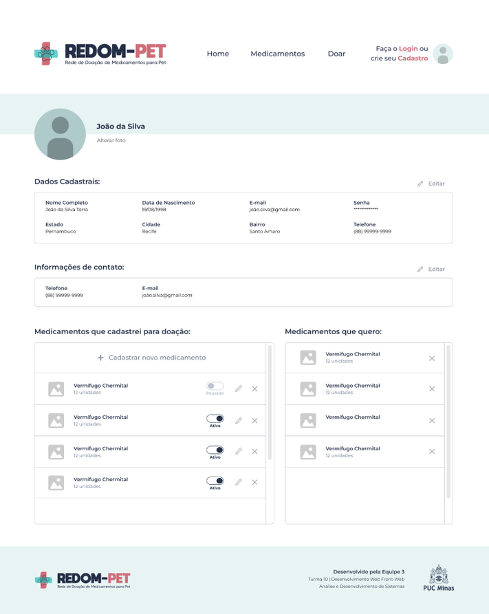
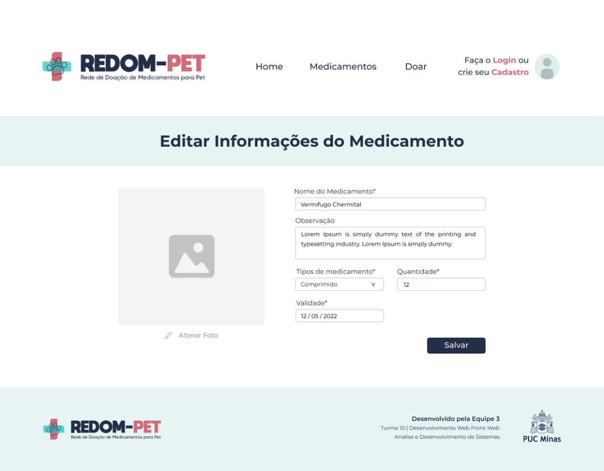
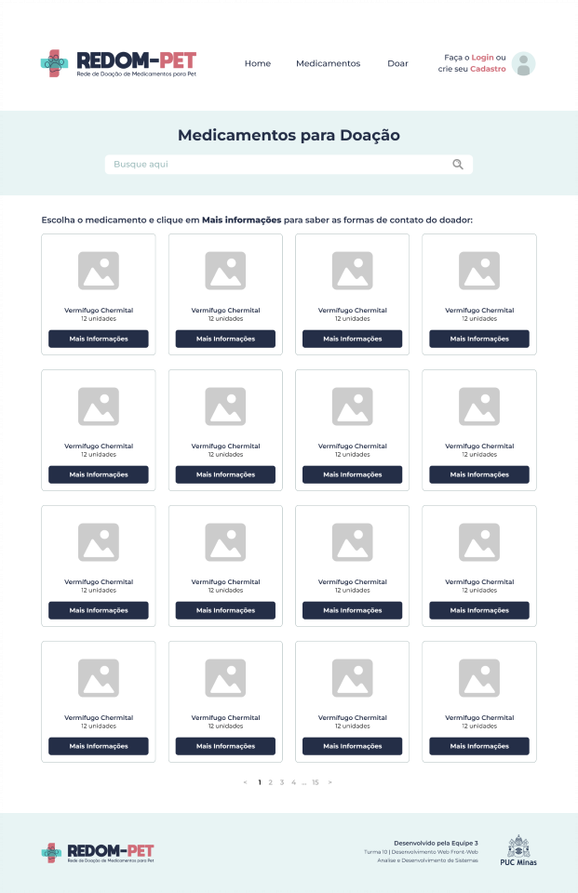
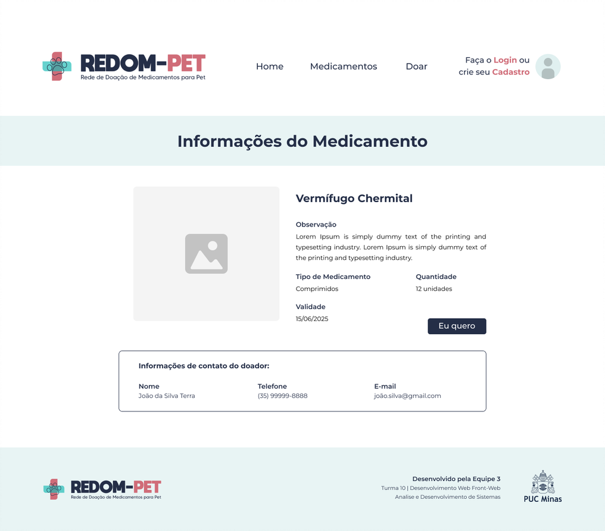
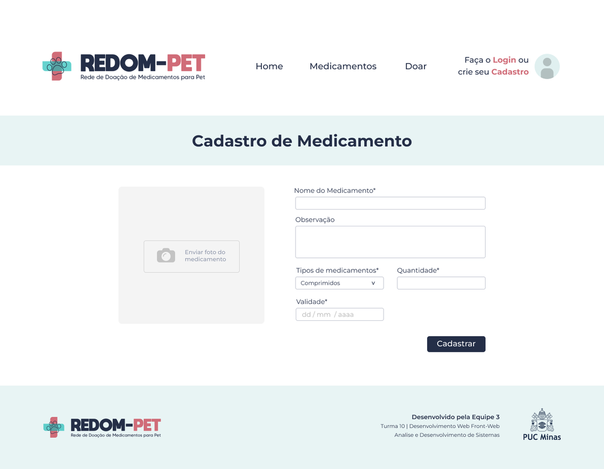

# Template padrão do site

O template padrão do site vai seguir a estrutura padrão do Wireframe elaborado na seção anterior, conforme mostra a Figura 15.

Para visualizar o template é só acessar o repositório do grupo [aqui](https://github.com/ICEI-PUC-Minas-PMV-ADS/REDOM-PET). O mesmo é composto pelos seguintes layouts:  

- Tela da Homepage 
- Tela de Login 
- Tela de Cadastro de Usuário 
- Tela de Medicamentos  
- Tela de Cadastro do Medicamento 
- Tela de Informações do Medicamento/Contato do doador
- Tela de Perfil do Usuário 
- Tela de Edição do Medicamento 

A responsividade do site segue o padrão do Bootstrap.
  
## Tela – Homepage
 
Objetivo: ser a primeira página que os usuários veem ao acessar a URL do site. 

- Ao acessar o site o usuário irá visualizar, no topo da página, na área de navegação, a logo da REDOM-PET e as opções clicáveis de Home, Medicamentos e Doar;  
- No canto superior direito, o usuário poderá criar o seu Cadastro no site ou fazer o Login; 
- É exibido, na Homepage, o “Quem Somos” e “Nossa Missão” - trata-se de uma descrição sobre a REDOM-PET; 
- O site conta com dois botões: o “Quero Doar” e “Quero Receber”; 
- Ao clicar no botão “Quero Doar”: 
    - o	Se não estiver logado, o usuário será redirecionado para a tela de Login onde preencherá com os seus dados de acesso. Após o login, a página de Cadastro de medicamento será exibida; 
        - Caso não esteja logado e, também, não tenha cadastro, na tela de Login haverá a possibilidade de clicar na opção “Quero me cadastrar” e prosseguir com o cadastro na tela “Cadastro de Usuário”; 
    - o	Caso esteja logado, o usuário será redirecionado para a tela de Cadastro de Medicamento; 
- Ao clicar no botão “Quero Receber” o usuário será redirecionado para a tela de visualização de Medicamentos; 
- Ao final da página serão exibidos alguns depoimentos sobre a REDOM-PET e o rodapé. 

## Tela – Login 
 
Objetivo: O sistema deve permitir o login do usuário cadastrado. 

- O usuário já cadastrado no site deverá informar o “E-mail” e “Senha” e clicar no botão “Acessar” para fazer o login; 
- Ao logar, o sistema redirecionará para a “Homepage” do site; 
- Em caso de esquecer a senha deverá clicar em “Esqueci a senha” e prosseguir para outra página para recuperá-la; 
- Caso não tenha realizado o cadastro ainda, o usuário deverá clicar em “Quero me cadastrar” e prosseguir com o cadastro em outra tela.

## Tela – Cadastro de Usuário 

Objetivo: Realizar o cadastro do usuário através do preenchimento das suas informações pessoais.  

- Na tela “Cadastro de Usuário” o usuário deverá preencher os respectivos campos com suas informações pessoais como nome completo, data de nascimento, endereço e telefone; 
- Em seguida, o usuário deverá colocar um e-mail e uma senha para efetivar o cadastro que, posteriormente, serão usados para o login no site.

## Tela – Perfil do Usuário 

Objetivo: Visualizar as informações de cadastro do usuário, como também a lista de medicamentos cadastrados pelo usuário e a lista com os medicamentos que ele deseja ter. 

- Nesta tela o usuário visualizará sua foto de perfil e seu nome, tendo a opção de editar a foto de perfil ao clicar em “Alterar foto”; 
- O usuário poderá visualizar seus dados cadastrais e ao clicar no botão “Editar” irá alterar qualquer um dos campos que desejar; 
- O usuário poderá visualizar suas informações de contato e ao clicar no botão “Editar” irá alterar qualquer um dos campos que desejar. Essas informações serão exibidas para as pessoas que clicarem em “Eu quero” no medicamento que este usuário cadastrou para doação; 
- Nessa tela o usuário visualizará os medicamentos que ele cadastrou para doação em forma de listagem tendo a opção de desativar ou ativar o anúncio do medicamento, editar as informações do medicamento ao clicar no ícone “lápis” e tirar o medicamento da listagem quando clicar no ícone “x”. No mesmo local, o usuário terá também a opção de “Cadastrar novo medicamento” caso ele tenha mais medicamentos para doação. 
- O usuário poderá acompanhar em uma listagem os medicamentos que ele marcou como “Eu Quero”, podendo clicar no nome do medicamento para ser redirecionado a tela de Informações de Medicamento do mesmo. 
 
## Tela – Edição do Medicamento 

Objetivo: Permitir a edição das informações do medicamento. 

- O usuário poderá editar as informações do medicamento como Nome do Medicamento, a Observação, a Quantidade, a Validade e o Tipo de Medicamento; 
- Na opção de “Tipo de Medicamento” ele poderá escolher os seguintes tipos: comprimido, líquido, spray, granulado, creme e outros; 
- Ao finalizar a edição deverá clicar em “Salvar” para que as alterações sejam salvas. 
 
## Tela – Medicamentos 

Objetivos: Visualizar os medicamentos cadastrados no site pelos doadores.  

- A tela contará com uma barra de pesquisa onde o usuário poderá fazer a busca pelo medicamento; 
- O usuário visualizará os medicamentos que pesquisou; 
- Ao clicar no botão “Mais informações” será encaminhado para uma página onde poderá visualizar, em detalhes, as informações do medicamento. 
 
## Tela - Informações do Medicamento 
 
Objetivo: Permitir a visualização das informações do medicamento, assim como as informações de contato do doador. 

- Ao entrar na tela de informações do medicamento o receptor irá visualizar campos como descrição, quantidade, tipo, validade e uma foto do medicamento; 
- Essa página contará com um botão “Eu quero” para sinalizar o interesse do receptor naquele medicamento; 
- Ao clicar no botão “Eu quero” aparecerá para o receptor as informações de contato com o doador, como nome, telefone e e-mail. 
 
## Tela – Cadastro de Medicamento 

Objetivo: Permitir o cadastro de um medicamento para possível doação através de informações relevantes como, nome, quantidade, data de validade, entre outros.  

- Ao acessar a tela é possível visualizar os campos para preenchimento, como Nome do Medicamento, Observação, anexo de imagem e um botão para confirmar o cadastro desejado. 
- Caso o usuário queira cadastrar um medicamento ele deve preencher obrigatoriamente os campos nome, tipo de medicamento, quantidade e informar a data de validade. Se desejar, existe a possibilidade de preencher o campo de “Observação” com informações a respeito do medicamento.  
- O campo tipo de medicamento é preenchido através de uma caixa de seleção que permite ao usuário selecionar se o medicamento é na forma de comprimido, líquido, spray, entre outros. 
- Desejando inserir uma imagem, deve-se clicar sobre a área “Enviar foto do medicamento”. 
- Após a conclusão das etapas anteriores basta clicar no botão cadastrar para concluir o cadastro do medicamento.

