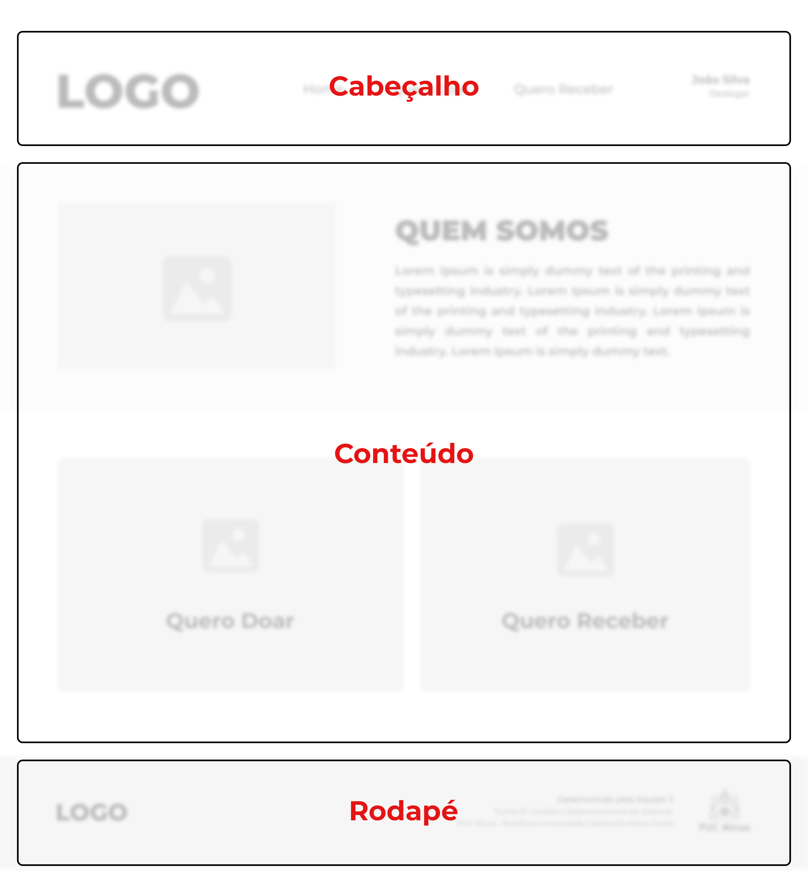
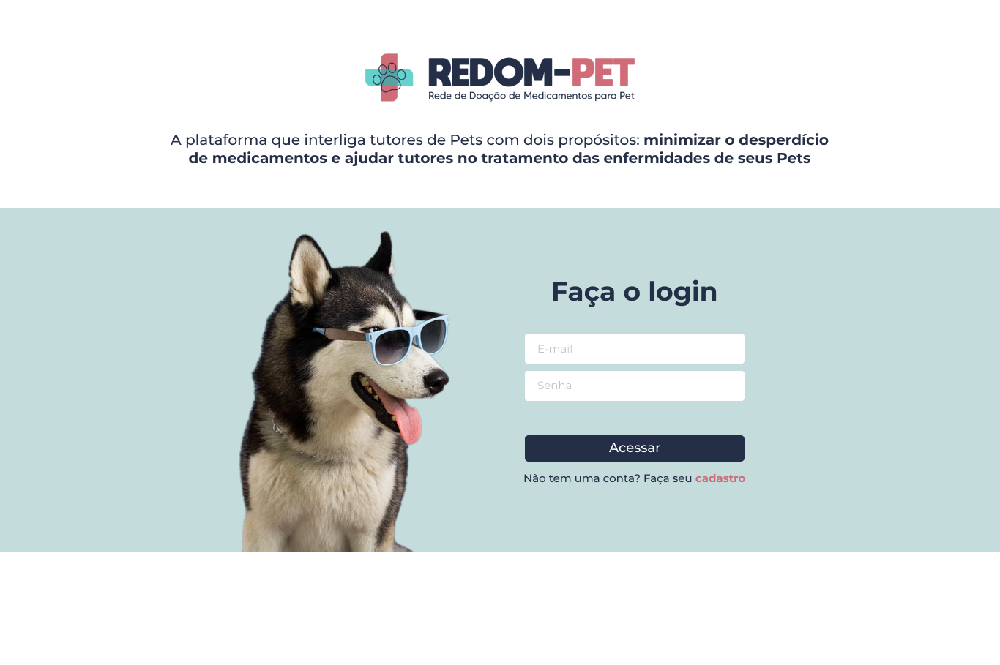

# Template padrão do site

O template padrão do site vai seguir a estrutura padrão do Wireframe elaborado na seção anterior, conforme mostra a Figura 15.

Para visualizar o template é só acessar o repositório do grupo [aqui](https://github.com/ICEI-PUC-Minas-PMV-ADS/REDOM-PET). O mesmo é composto pelos seguintes layouts:  

- Tela de Login
- Tela de Cadastro de Usuário
- Tela da Homepage
- Tela de Cadastro do Medicamento
- Tela de Medicamentos  
- Tela de Perfil do Usuário

A responsividade do site segue o padrão do Bootstrap.
  
## Tela – Homepage

Objetivo: ser a primeira página que os usuários veem após realizar o login.

- Ao acessar o site o usuário irá visualizar, no topo da página, na área de navegação, a logo da REDOM-PET e as opções clicáveis de Home, Quero Doar e Quero Receber;
- No canto superior direito, o usuário irá visualizar seu nome e a opção Deslogar;  
- É exibido, na Homepage, o “Quem Somos” - trata-se de uma descrição sobre a REDOM-PET;  
- O site conta com dois botões: o “Quero Doar” e “Quero Receber”:
    - Ao clicar no botão “Quero Doar” o usuário será redirecionado para a tela de Cadastro de Medicamento;  
    - Ao clicar no botão “Quero Receber” o usuário será redirecionado para a tela de visualização de Medicamentos;  
- Ao final da página será exibido o rodapé.  

## Tela – Login

Objetivo: Permitir o login do usuário cadastrado.  

- O usuário já cadastrado no site deverá informar o “E-mail” e “Senha” e clicar no botão “Acessar” para fazer o login;
- Ao logar, o sistema redirecionará para a “Homepage” do site;
- Caso ainda não tenha realizado o cadastro, o usuário deverá clicar em “Faça seu cadastro” e prosseguir com o cadastro em outra tela.

## Tela – Cadastro de Usuário

Objetivo: Realizar o cadastro do usuário através do preenchimento das suas informações pessoais.  

- Na tela “Cadastro de Usuário” o usuário deverá preencher os respectivos campos com suas informações pessoais como nome completo, data de nascimento, endereço e telefone;
- Em seguida, o usuário deverá colocar um e-mail e uma senha para efetivar o cadastro que, posteriormente, serão usados para o login no site.

## Tela – Perfil do Usuário

Objetivo: Visualizar as informações cadastradas pelo usuário, assim como suas informações para contato.

- O usuário poderá visualizar seus dados cadastrais.
- O usuário poderá visualizar suas informações de contato.

## Tela – Medicamentos

Objetivos: Visualizar os medicamentos cadastrados no site pelos doadores.  

- A tela contará com uma lista dos medicamentos cadastrados no site.
- Na lista, o usuário  terá acesso as informações dos medicamentos, bem como o contato do doador.

## Tela – Cadastro de Medicamento

Objetivo: Permitir o cadastro de um medicamento para possível doação através de informações relevantes como, nome, quantidade, data de validade, entre outros.  

- Ao acessar a tela é possível visualizar os campos para preenchimento, como Nome do Medicamento, anexo de imagem e um botão para confirmar o cadastro desejado.
- Caso o usuário queira cadastrar um medicamento ele deve preencher obrigatoriamente os campos nome, tipo de medicamento, quantidade e informar a data de validade.
- O campo tipo de medicamento é preenchido através de uma caixa de seleção que permite ao usuário selecionar se o medicamento é na forma de comprimido, líquido, spray, entre outros.
- Desejando inserir uma imagem, deve-se clicar sobre a área “Enviar foto do medicamento”. Em seguida, basta clicar em “Preview Imagem” para visualizar a foto.
- Após a conclusão das etapas anteriores basta clicar no botão cadastrar para concluir o cadastro do medicamento.