# Funcionalidades do Sistema (Telas)

Nesta seção são apresentadas as telas desenvolvidas pelo grupo em HTML e CSS para cada uma das funcionalidades do sistema.  

## Homepage (RF-07)

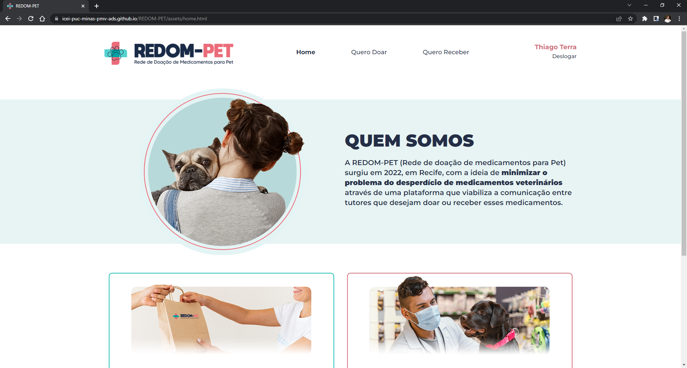

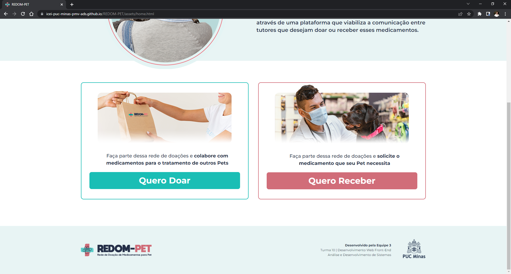

### Requisitos atendidos

- RF-07: O site deve ter em sua homepage informações sobre a REDOM-PET (Rede de Doação de Medicamentos para PET), assim como um botão de “Quero Doar” e um botão de “Quero Receber”.

### Artefatos da funcionalidade

- home.html
- home-styles.css
- logo-icone.png
- logo.png
- menina-home.png
- querodoar-home.png
- queroreceber-home.png
- logo-rodape.png
- logopucminas-rodape.png

### Estrutura de Dados

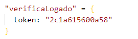

### Instruções de acesso

- Abra o navegador de internet e acesse o site: https://icei-puc-minas-pmv-ads.github.io/REDOM-PET;
- Realize o login com seu E-mail e Senha, caso não tiver um cadastro clique em “cadastrar” para criar uma conta;
- Após realizar o login, você será redirecionado para a Homepage.

## Login (RF-05)

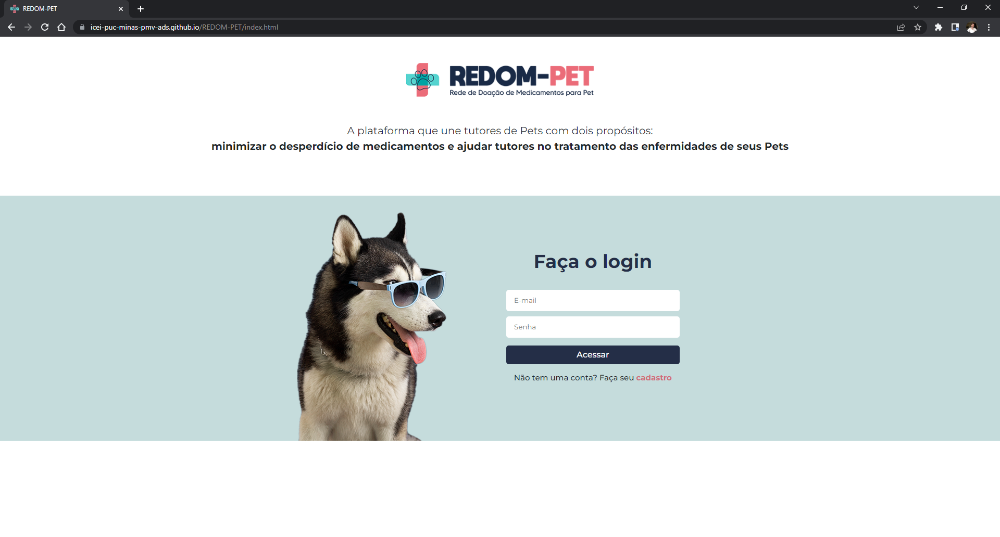

### Requisitos atendidos

- RF-05: O sistema permitirá o acesso dos usuários através de uma página com login e senha.

### Artefatos da funcionalidade

- index.html
- index-styles.css
- logo-icone.png
- logo.png
- dog-login.png

### Estrutura de Dados

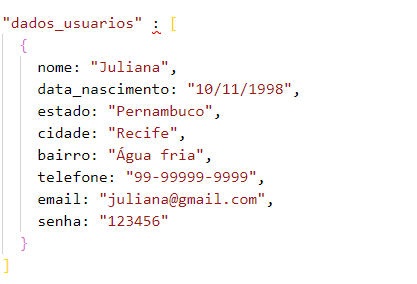

### Instruções de acesso

- Abra o navegador de internet e acesse o site: https://icei-puc-minas-pmv-ads.github.io/REDOM-PET; 
- A primeira página exibida é a tela de Login;

## Cadastro de Usuário (RF-01, RF-02)

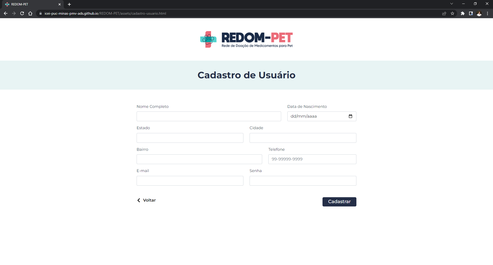

### Requisitos atendidos

- RF-01: O sistema permitirá que usuários realizem cadastro.  
- RF-02: O cadastro do usuário deverá conter: Nome completo, e-mail, telefone, bairro, cidade, estado, login, senha e data de nascimento.

### Artefatos da funcionalidade

- cadastro-usuario.html  
- cadastro-usuario-styles.css
- logo-icone.png
- logo.png  
- seta-voltar.png

### Estrutura de Dados

### Instruções de acesso

- Abra o navegador de internet e acesse o site: https://icei-puc-minas-pmv-ads.github.io/REDOM-PET;
- A primeira página exibida é a tela de login;
- Para acessar a tela de cadastro, basta clicar em “cadastrar”.

## Perfil do Usuário (RF-02)

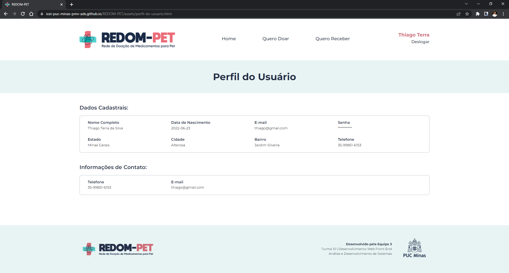

### Requisitos atendidos

- RF-02: O cadastro do usuário deverá conter: Nome completo, e-mail, telefone, bairro, cidade, estado, senha e data de nascimento.

### Artefatos da funcionalidade

- perfil-do-usuario.html
- perfil-do-usuario-styles.css
- logo-icone.png
- logo.png
- logo-rodape.png
- logopucminas-rodape.png

### Estrutura de Dados

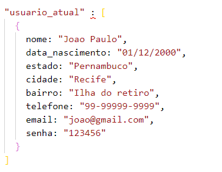

### Instruções de acesso

- Abra o navegador de internet e acesse o site: https://icei-puc-minas-pmv-ads.github.io/REDOM-PET;  
- Realize o login com seu E-mail e Senha, caso não tiver um cadastro clique em “cadastrar” para criar uma conta;  
- Após realizar o login, você será redirecionado para a Homepage.  
- Clique no nome do usuário no canto direito na barra de navegação para acessar o “Perfil do Usuário”.

## Medicamentos (RF-06)

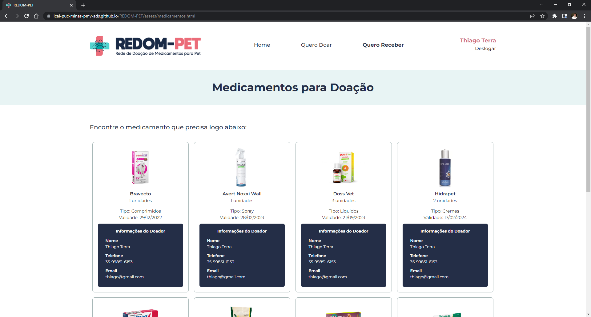

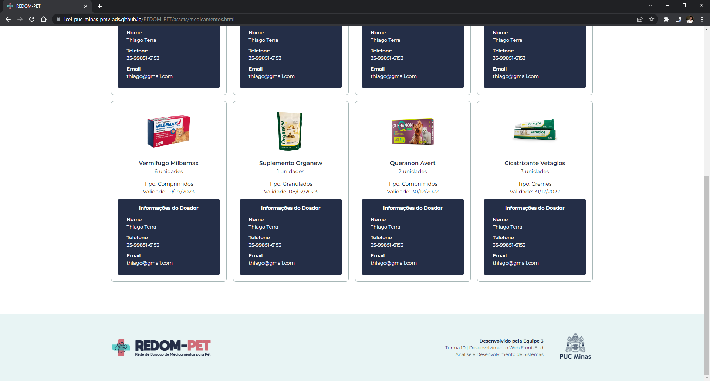

### Requisitos atendidos

- RF-06: O site irá exibir as informações do medicamento e de contato do doador para que o receptor possa se comunicar com o mesmo.

### Artefatos da funcionalidade

- medicamento.html
- medicamento-styles.html
- logo-icone.png
- logo.png
- logo-rodape.png
- logopucminas-rodape.png

### Estrutura de Dados

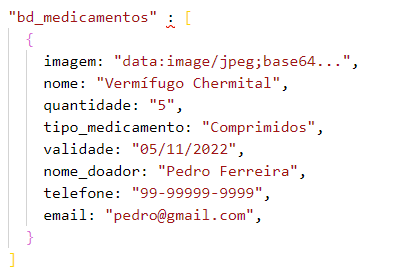

### Instruções de acesso

- Abra o navegador de internet e acesse o site: https://icei-puc-minas-pmv-ads.github.io/REDOM-PET;  
- Realize o login com seu E-mail e Senha, caso não tiver um cadastro clique em “cadastrar” para criar uma conta;  
- Após realizar o login, você será redirecionado para a Homepage;
- Clique em “Quero Receber” para acessar a página dos medicamentos cadastrados no sistema.

## Cadastro de Medicamento (RF-03, RF-04)

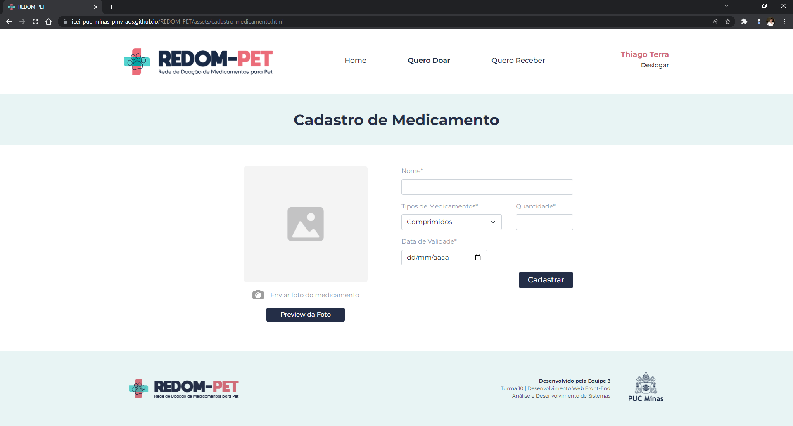

### Requisitos atendidos

- RF-03: O site deve permitir o cadastro de medicamentos para doação, com tais campos de preenchimento: Nome, Tipos de Medicamentos, Quantidade e Validade.
- RF-04: O site permitirá a submissão de registros fotográficos dos medicamentos ao cadastrá-los de caráter obrigatório.

### Artefatos da funcionalidade

- cadastro-medicamento.html
- cadastro-medicamento-styles.css
- logo-icone.png
- logo.png
- foto-medicamento.png
- camera-cadastro-de-medicamento.png
- logo-rodape.png
- logopucminas-rodape.png

## Estrutura de Dados

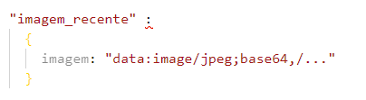

 
### Instruções de acesso

- Abra o navegador de internet e acesse o site: https://icei-puc-minas-pmv-ads.github.io/REDOM-PET;  
- Realize o login com seu E-mail e Senha, caso não tiver um cadastro clique em “cadastrar” para criar uma conta;  
- Após realizar o login, você será redirecionado para a Homepage;
- Clique em “Quero Doar” para acessar a página de “Cadastro de Medicamento”.