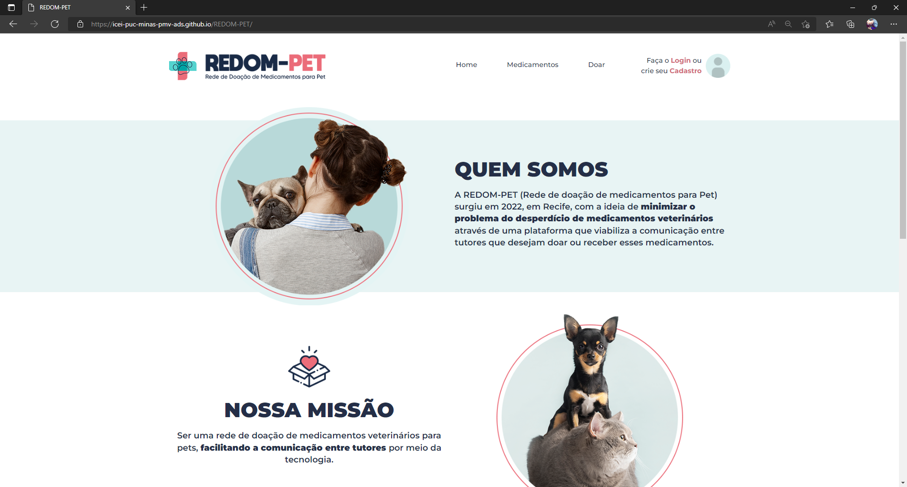
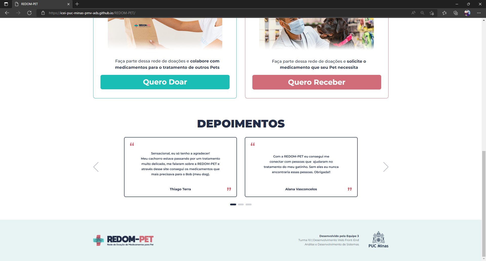
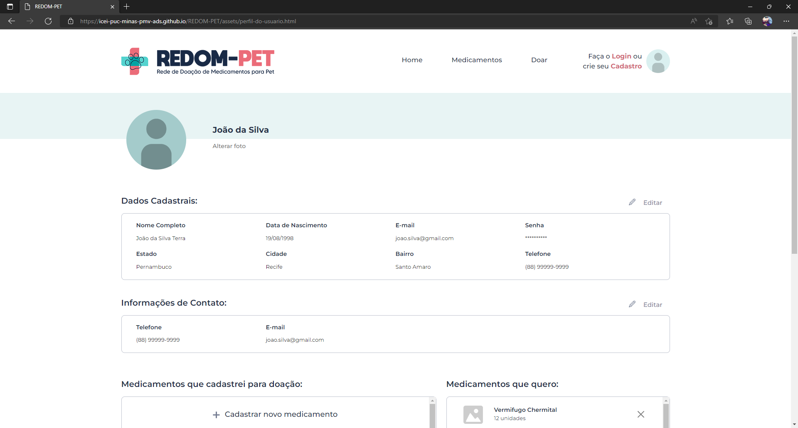
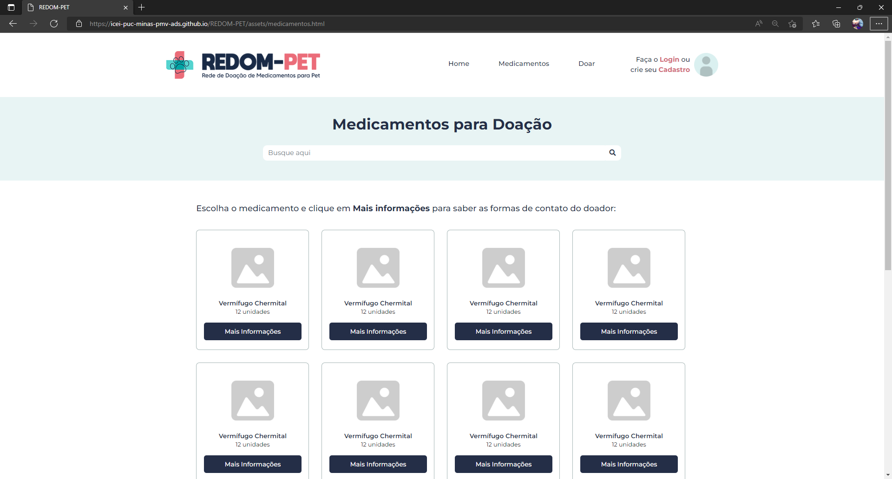
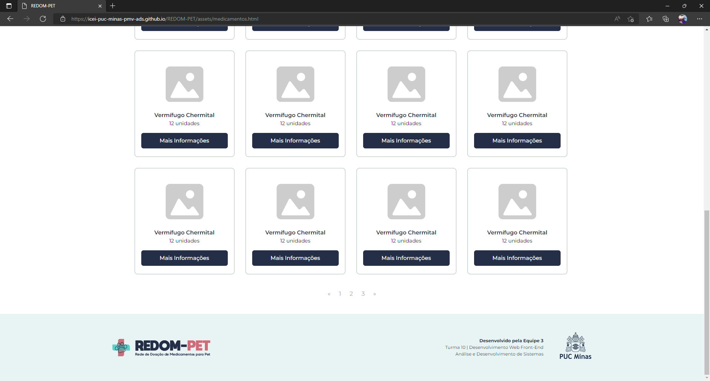
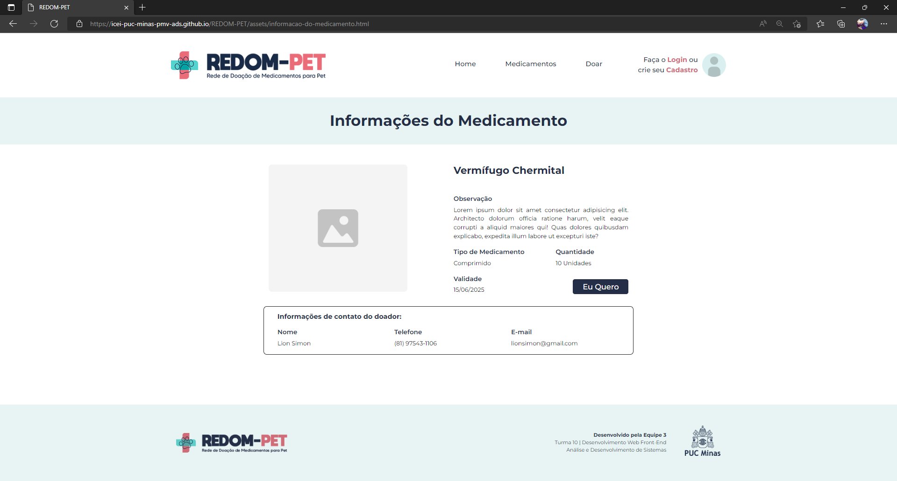
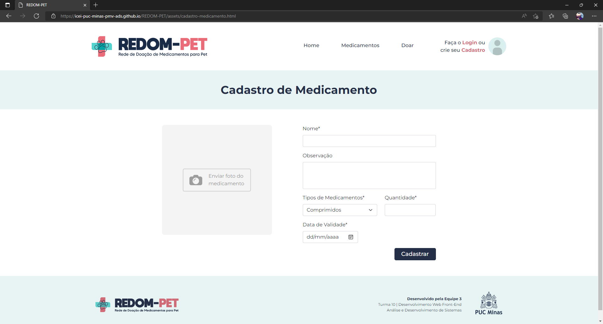
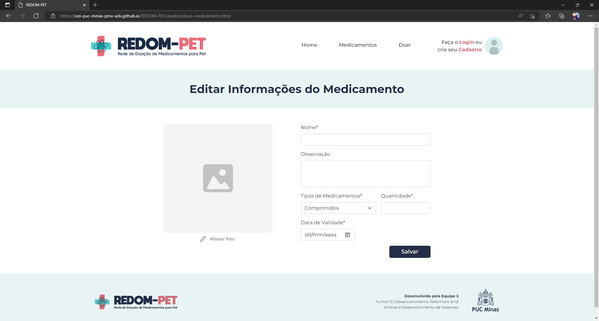

# Funcionalidades do Sistema (Telas)

Nesta seção são apresentadas as telas desenvolvidas pelo grupo em HTML e CSS para cada uma das funcionalidades do sistema.  

## Homepage (RF-12) 

### Requisitos atendidos 

- RF-12: O site deve ter em sua homepage a missão e informações sobre a REDOM-PET (Rede de Doação de Medicamentos para PET), assim como um botão de “Quero Doar” e um botão de “Quero Receber” e uma seção dedicada aos depoimentos.
 
### tefatos da funcionalidade 
- index.html 
- style.css 
- logo.png 
- iconefoto-cabecalho.png
- menina-home.png 
- nossamissao-home.png 
- catdog-home.png 
- querodoar-home.png 
- queroreceber-home.png 
- depoimento-1.png 
- depoimento-2.png 
- depoimento-3.png 
- depoimento-4.png 
- depoimento-5.png 
- depoimento-6.png 
- logo-rodape.png 
- logopucminas-rodape.png 

### Instruções de acesso

- Abra o navegador de internet e acesse o site: https://icei-puc-minas-pmv-ads.github.io/REDOM-PET;
- A primeira página exibida é a Homepage.

## Login (RF-07)

### Requisitos atendidos 

- RF-07: O sistema permitirá o acesso dos usuários através de uma página com login e senha.

### Artefatos da funcionalidade 
- login.html 
- login-styles.css 
- logo.png 
- dog-login.png 
 
### Instruções de acesso

- Abra o navegador de internet e acesse o site: https://icei-puc-minas-pmv-ads.github.io/REDOM-PET;
- A primeira página exibida é a Homepage;
- Em seguida clique em “Login” na barra de navegação.

## Cadastro de Usuário (RF-01, RF-03) 

### Requisitos atendidos 
- RF-02: O sistema permitirá que os usuários façam alterações em seus cadastros. 
- RF-10: O site deverá conter um botão para o doador pausar o anúncio e quando esse botão for acionado, o contato com o doador será suspenso. 
- RF-11: O site deve ter um botão que permita a exclusão do remédio pelo doador quando ele desejar ou fizer a doação do mesmo. 

### Artefatos da funcionalidade
- perfil-do-usuario.html  
- perfil-do-usuario-styles.css 
- logo.png 
- iconefoto-cabecalho.png
- iconefoto-perfil-do-usuario.png 
- lapis-perfil-do-usuario.png
- logo-rodape.png 
- logopucminas-rodape.png 

### Instruções de acesso

- Abra o navegador de internet e acesse o site: https://icei-puc-minas-pmv-ads.github.io/REDOM-PET;
- A primeira página exibida é a Homepage;
- Clique em “Login” na barra de navegação;
- Efetue o login;
- Clique no ícone de foto no canto direito na barra de navegação para ver o “Perfil do usuário”;
- Se quiser alterar alguma informação, clique no ícone de lápis ao lado de “Dados cadastrais” e “Informações de Contato”;
- Caso queira pausar algum anúncio de medicamento, deverá desativar o botão localizado na seção “Medicamentos que cadastrei para doação”, ao lado do ícone de lápis.

## Medicamentos (RF-08) 

### Requisitos atendidos

- RF-08: O site deve ter uma funcionalidade de pesquisa que permita ao receptor buscar pelo medicamento que deseja obter. 

### Artefatos da funcionalidade
- medicamento.html 
- medicamento-styles.html 
- logo.png 
- iconefoto-cabecalho.png
- imagem-medicamento.png 
- logo-rodape.png 
- logopucminas-rodape.png 

### Estrutura de Dados

Será desenvolvido posteriormente.
 
### Instruções de acesso

- Abra o navegador de internet e acesse o site: https://icei-puc-minas-pmv-ads.github.io/REDOM-PET;
- A primeira página exibida é a Homepage;
- Clique em “Medicamentos” para acessar a página dos medicamentos cadastrados e realizar a busca por algum específico;

## Informações do Medicamento (RF-09) 

### Requisitos atendidos: 

- RF-09: O site deve ter um botão para exibir as informações do medicamento e de contato do doador para que o receptor possa se comunicar com o mesmo. 

### Artefatos da funcionalidade
- informacao-do-medicamento.html 
- informacao-do-medicamento-styles.css 
- logo.png 
- iconefoto-cabecalho.png 
- foto-medicamento
- logo-rodape.png 
- logopucminas-rodape.png 

### Instruções de acesso

- Abra o navegador de internet e acesse o site: https://icei-puc-minas-pmv-ads.github.io/REDOM-PET;
- A primeira página exibida é a Homepage;
- Clique em “Medicamentos” para acessar a página dos medicamentos cadastrados e realizar a busca por algum específico;
- Clique “Mais informações” para acessar as informações do medicamento;
- Se tiver interesse no medicamento, clique em “Eu quero” para visualizar as informações do doador.

## Cadastro de Medicamento (RF-04, RF-05) 

### Requisitos atendidos

- RF-04: O site deve permitir o cadastro de medicamentos para doação, com tais campos de preenchimento: Nome, Observação, Tipos de Medicamentos, Quantidade e Validade. 
- RF-05: O site permitirá a submissão de registros fotográficos dos medicamentos ao cadastrá-los. 

### Artefatos da funcionalidade
- cadastro-medicamento.html 
- cadastro-medicamento-styles.css 
- logo.png 
- iconefoto-cabecalho.png 
- camera-cadastro-de-medicamento.png 
- logo-rodape.png 
- logopucminas-rodape.png

## Estrutura de Dados

Será desenvolvido posteriormente.
 
### Instruções de acesso

- Abra o navegador de internet e acesse o site: https://icei-puc-minas-pmv-ads.github.io/REDOM-PET;
- A primeira página exibida é a Homepage;
- Clique em “Doar” para acessar a página de “Cadastro de Medicamento”;
- Preencha os campos obrigatórios e clique em “Cadastrar”.

## Editar Informações do Medicamento (RF-13) 

### Requisitos atendidos
- RF-13: O site deve permitir a edição das informações do medicamento cadastrado.

### Artefatos da funcionalidade
- edicao-medicamento.html 
- edicao-medicamento-styles.css 
- logo.png 
- iconefoto-cabecalho.png 
- foto-medicamento.png
- lapis-perfil-do-usuario
- logo-rodape.png 
- logopucminas-rodape.png

### Instruções de acesso

- Abra o navegador de internet e acesse o site: https://icei-puc-minas-pmv-ads.github.io/REDOM-PET;
- A primeira página exibida é a Homepage;
- Clique em “Login” na barra de navegação;
- Efetue o login;
- Clique no ícone de foto no canto direito na barra de navegação para ver o “Perfil do usuário”
- Nessa página você irá visualizar uma coluna no canto esquerdo com os medicamentos cadastrados, clique no ícone de lápis para editar as informações do medicamento selecionado.
